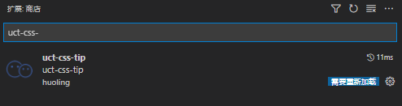

# 配置步骤

1. 安装 uct-theme
   ```
   npm i uct-theme
   ```
2. 生成 uct-theme 文件,可以自己配置 ui 规范
   ```
   npx uct-theme init
   ```
3. 将 scss 导入项目

   ```
   @import './uct-theme.scss'; // 注意文件位置，导入顺序不可变
   @import 'uct-theme/index.scss';
   ```

# 使用

## 直接在标签上添加 class，无需再自己手写 css 样式

```
<div class='m-t-10 c-red'>margin-top:10px; color:#f00;</div>
```

## 使用文档（<>表示必填，[]表示可选，内部为$的参数可以在 uct-theme 内自行配置。）

```
// 偏移
  <m|p>-[l|t|r|b|x|y]-<$space-sizes>
  m-t-10 margin-top:10px;
  m-x-10 margin: 10px 0;
  m-y-10 margin: 0 10px;
  m-10 margin: 10px;
  p-t-10 padding-top:10px;
  p-x-10 padding: 10px 0;
  p-y-10 padding: 0 10px;
  p-10 padding: 10px;

// 颜色
  <c|bc>-<primary|success|error|warning|info|bgc|main|base|tips|light|brc|black|white|gray|dark|blue|skyblue|green|red|orange|yellow>[-<1|2|3|4|5|6|7|8|9>]
  <!-- 字体颜色 -->
  c-red color:#f00;
  <!-- 背景颜色 -->
  bc-red background-color: #f00;
  bc-red-1 background-color: rgba(#f00,.1);
  <!-- 边框颜色 -->
  border-<s|ds|dt|db>-<$border-sizes>-<primary|success|error|warning|info|bgc|main|base|tips|light|brc|black|white|gray|dark|blue|skyblue|green|red|orange|yellow>
  border-s-1-red border:1px solid #f00;
  border-s-t-1-red border-top:1px solid #f00;

// 圆角
  br-[t|l|r|b|tl|tr|bl|br]-<$radius-sizes>
  br-tl-l10 border-top-left-radius:10px;
  br-t-10 border-radius:10px 10px 0 0;
  br-l-10 border-radius: 10px 0 0 10px;
  br-r-10 border-radius: 0 10px 10px 0;
  br-b-10 border-radius: 0 0 10px 10px;
  br-10 border-radius: 10px;


// 字体
  font-<$font-size>
  font-12 font-size:12px;

// 文本溢出省略
  more-<$omit-sizes>
  more-1
  {
    overflow: hidden;
    text-overflow: ellipsis;
    white-space: nowrap;
  }
  more-3
  {
    display: -webkit-box;
    -webkit-box-orient: vertical;
    -webkit-line-clamp: 3;
    overflow: hidden;
    text-overflow: ellipsis;
  }

// flex
  flex-<x|y|xr|yr>-<s|c|e|sb|sa>-<s|c|e|baseline|stretch>
  flex-x-sb-s
  {
    display: flex;
    flex-direction:row;
    justify-content:space-between;
    align-items:flex-start;
  }

// grid
  grid-<x|y>-<$grid-sizes>
  grid-y-1
  {
    display:grid;
    grid-auto-flow:column;
    grid-template-rows: repeat(1, minmax(0, 1fr));
  }
  grid-x-1
  {
    display:grid;
    grid-template-column: repeat(1, minmax(0, 1fr));
  }

// gap
  gap-[x|y]-<$gap-sizes>
  gap-10 gap: 10px;
  gap-x-20 column-gap: 20px;
  gap-y-40 row-gap: 40px;

```

## 基本单位

- 配置单位在 uct-theme.scss 文件中
- 可改变基本单位如 1rem,2rpx 等
- 所有生成的 css 大小都会 \* $unit

```
// 基本单位
$unit: 1px;
```

## 响应式

- 说明
  | 断点前缀 | 最小宽度 | CSS |
  | --- | ---- | ----|
  | | 0 | @media (min-width: 0) { ... } |
  | sm | 768px | @media (min-width: 768px) { ... } |
  | md | 1024px | @media (min-width: 1024px) { ... } |
  | xl | 1280px | @media (min-width: 1280px) { ... } |

- 使用

  所有 uct-theme 生成的 css 前加前缀

  ```
  <div class="md-c-blue c-red sm-m-t-10">123</div>
  ```

# 删除未使用的 css

[purgeCss 中文网](https://purgecss.zcopy.site/plugins/webpack.html#installation)

- 为了使开发经验尽可能的富有成效，uct-theme 为您生成了成千上万的功能类，其中大部分您可能不会真正使用。
- 把 uct-theme 想象成一个巨大的乐高盒子--您把它倾倒在地板上，建造您想建造的东西，然后当您完成后，您把所有您不用的碎片放回盒子里。
- 例如，uct-theme 为您的间距尺度中的每一个尺寸，为您可能想要应用边距的元素的每一个侧面，在您的项目中使用的每一个断点生成边距实用程序。这导致了数以百计的不同组合，这些组合都是重要的，但不可能都是需要的。
- 当构建生产时，您应该总是使用 purge 来 tree-shake 优化未使用的样式，并优化您的最终构建大小, 删除未使用的样式时，很难最终得到超过 10kb 的压缩 CSS。

# VS Code 插件

> vscode 插件市场搜索 uct-css-tip

## uct-css-tip

- uct-css-tip 是一款专门为 css 提供做的 vscode 插件
- 目前支持自定义 css 文件提示（默认提示 uct-theme 下的 index.css）
- 提示自定义 css 需要在 uct-css-tip 的扩展设置内修改 css 文件路径如（D:\nocode\packages\uct-theme\index.css）


